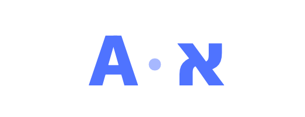

<p align="center">
  
</p>

<h1 align="center">AutoLang</h1>

<p align="center">
  <strong>Type Hebrew and English interchangeably — AutoLang fixes the wrong-layout mess as you go.</strong>
</p>

<p align="center">
  <a href="LICENSE"></a>
  
  
  
</p>

---

You meant to type `שלום` but the keyboard was on English, so you got `akuo`. AutoLang
notices, rewrites it to `שלום`, and flips your input language — automatically, or on a
hotkey. It's the classic "Punto Switcher" idea, built natively for Hebrew ⇄ English on
the Mac.

> **Layout fixing, not translation.** It re-maps the *keys you pressed* into the other
> layout. It never changes what you meant — only which alphabet it lands in.

## Features

- **Auto-detect & convert** — as you type, wrong-layout gibberish is rewritten to the
  language it was clearly meant to be. Precision-first: it only converts a word that's
  gibberish in the active layout *and* a real word in the other.
- **Phrase-aware** — ambiguous words (valid in both languages) are judged in context,
  using language *momentum* and a multi-word retroactive fold, not in isolation.
- **Manual convert** — `⌃⌥H` converts the current word and switches language.
- **Clipboard convert** — `⌃⌥V` transliterates copied text EN⇄HE (fixes pasted mistakes).
- **Typo correction** *(optional)* — inserts elided apostrophes (`dont`→`don't`) and fixes
  safe typos (`helllo`→`hello`, `teh`→`the`) while leaving names like `yaron` untouched.
- **Cursor-aware language** — arrow or click back into a word and the input language
  switches to match it (via Accessibility), so you never insert English into a Hebrew word.
- **Learns from you** — undo a conversion and that word is protected forever; browse and
  edit the list from the menu.
- **Stays out of the way** — never touches password fields; per-app rules disable it in
  terminals, editors, and anywhere you choose.
- **Statistics** — a menu summary plus a self-contained HTML dashboard of your usage.
- **Brand menu-bar icon** — five styles that also show the live language (A / א),
  switchable on the fly.
- **Capitalization preserved**, one-press **undo** on any auto-edit, and **launch at login**.

## Quick start

```bash
bash scripts/setup-signing.sh   # once: a stable local signing identity (see below)
bash scripts/install.sh         # build + install into /Applications + launch
```

On first launch, grant **Accessibility** when prompted (System Settings ▸ Privacy &
Security ▸ Accessibility) and relaunch. A brand icon (e.g. `A·א`) appears in the menu bar.

Prefer to run it in place instead of installing?

```bash
bash scripts/build.sh
open AutoLang.app
```

Verify the core transliteration + detection logic with no GUI or permissions:

```bash
./AutoLang.app/Contents/MacOS/AutoLang --selftest
```

> **Build note.** This machine's Command Line Tools ship a broken SwiftPM manifest, so
> the build compiles with `swiftc` directly and hand-assembles the `.app`. `Package.swift`
> is kept for when full Xcode is available.

## Usage

| Action | How |
|---|---|
| Convert the word you just typed | **⌃⌥H** (before the space) |
| Convert the clipboard EN⇄HE | **⌃⌥V** |
| Undo the last auto-conversion | **Backspace**, immediately after |
| Turn features on/off | the menu-bar icon |

Turn on **Auto-detect & convert** in the menu to get automatic conversion as you type;
a brief icon flash confirms each one.

## Menu-bar icon styles

The mark pairs **A** (Latin) with **א** (Hebrew aleph) and always shows the active
language. Pick from **Icon style** in the menu:

| Style | Look |
|---|---|
| **Duo monogram** | `A · א`, active script bold, the other faded |
| **Pill / Swap arrow / Cycle arrows** | active letter in a badge, a circular arrow, or a two-arrow cycle |
| **Classic bubble** | speech bubble + `EN` / `עב` |

## How it works

| Piece | File | Role |
|---|---|---|
| Key ↔ letter map | `KeyMap.swift` | keycode → English/Hebrew char (standard US/Israeli layouts) |
| Global listener | `EventTapController.swift` | `CGEventTap`; buffers words, catches hotkeys, self-heals |
| Detection oracle | `SpellChecker.swift` | `NSSpellChecker` EN/HE + Hebrew orthography + safe typo rules |
| Decision engine | `Engine.swift` | momentum, multi-word fold, typo fix, undo |
| Layout read/switch | `InputSourceManager.swift` | TIS: current language + switch |
| Text replacement | `TextInjector.swift` | backspaces + unicode injection (tags its own events) |
| Skip zones / rules | `AppGuard.swift`, `AppRules.swift` | secure fields + per-app exclusions |
| Personal dictionary | `UserDictionary.swift` | protected words, learned from undos |
| Menu bar & icons | `AppDelegate.swift`, `MenuBarIcon.swift` | status item, menus, brand marks |

## Permissions & privacy

AutoLang needs **Accessibility** because it reads keystrokes globally and posts corrected
ones — that's the whole job. It is keylogger-shaped by necessity and privacy-first by
design:

- The keystroke buffer is **in-memory only**, cleared at every word boundary.
- **Nothing is written to disk** except your own settings, learned words, and usage counts
  (local `UserDefaults`).
- **No network code anywhere** — no URLs, sockets, or analytics. Everything stays on your Mac.
- It **stays out of password/secure fields** and any apps you exclude.

Because it's open source, you can verify all of this before granting Accessibility.

### A note on signing

Ad-hoc signing gives the app a new identity every build, which invalidates the macOS
Accessibility grant each time. `scripts/setup-signing.sh` creates a **stable self-signed
identity** (in its own keychain, its own password — not your login) so the grant persists
across rebuilds. Undo it with `scripts/remove-signing.sh`. For sharing a binary with
others, notarization with an Apple Developer ID is the friction-free path.

## Roadmap

Done through **v0.9.1**: auto-detect, phrase context, typo correction, personal dictionary,
per-app rules, clipboard convert, statistics, launch-at-login, brand icons, and
cursor-aware language matching (switch layout to the word you edit).

Ideas not yet built: a preferences window, configurable hotkeys, a third language, a real
bigram model, and Developer-ID notarization for frictionless distribution.

## License

Licensed under the Apache License 2.0 — see [LICENSE](LICENSE).
